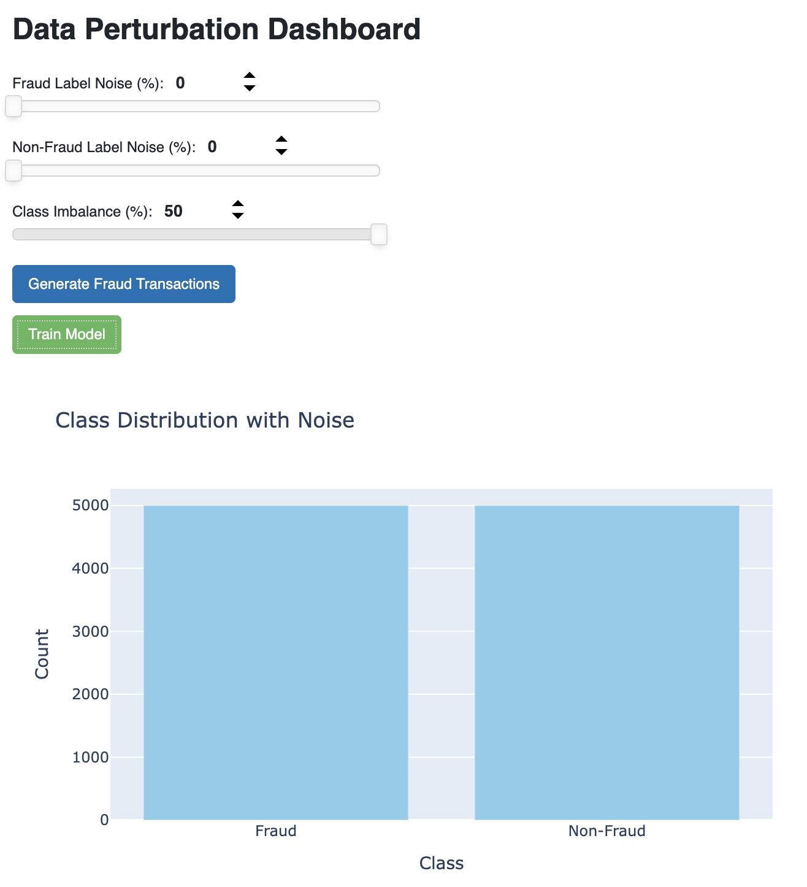
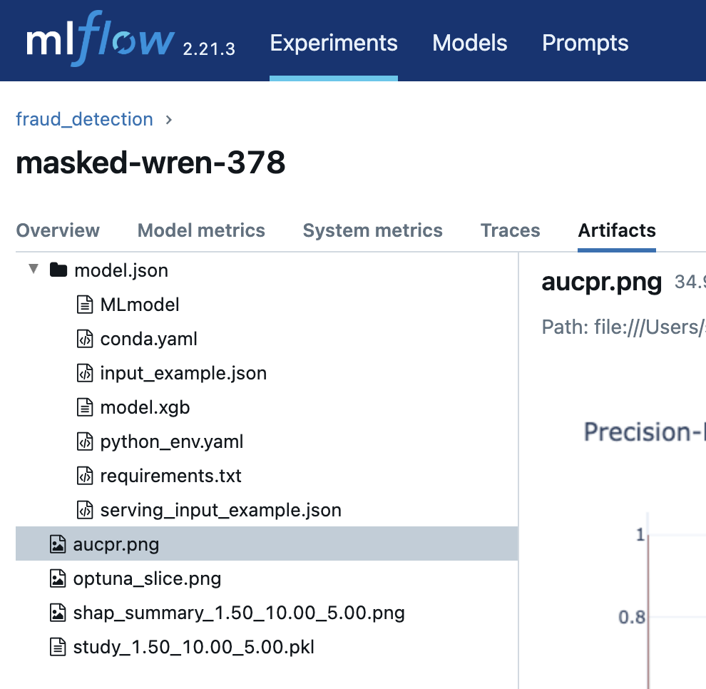

# Exploring Modeling Impacts of Class Imbalance and Label Noise on Transaction Fraud Detection

Noisy labels exacerbate the class imbalance problem, and this is especially true in the case of fraud detection. In this project, we will explore the impact of class imbalance and label noise on transaction fraud detection using a synthetic dataset.
The dataset will be generated using a set of rules that simulate the behavior of customers and merchants. The goal is to create a dataset that is representative of real-world transaction data, while also allowing us to control for various factors including those under study: class imbalance and label noise. This setup will allow us to show how difficult it becomes to identify the best performing model, especially due to label noise. We will use an example of detecting fraud on totally synthetic transaction data to explore these concepts.


## Quick Setup

One time setup:
* Install [conda](https://www.anaconda.com/docs/getting-started/miniconda/install)
* Download this repo: `git clone https://github.com/sloscal1/gen_data.git`
* Open the repo in a terminal `cd gen_data`
* Create the environment `conda env create -f setup/environment.yaml`
* Activate the environment `conda activate eda`
* Install this code: `python3 -m pip install -e .`

Every time setup:
* Activate the environment `conda activate eda`
* Start the data perturbation UI: `python -m eda.data_perturbation`
* Start the mlflow server in another terminal:
    ```bash
    mlflow server \
        --backend-store-uri sqlite:///mlflow.db \
        --default-artifact-root ./mlruns \
        --host 0.0.0.0:8080
    ```

## Usage
With the Data Perturbation UI visible you will see a few prominent items, but first it's helpful to understand what's happening.




We're exploring what happens when we train a classification model on an imbalanced and noisy class label. We can configure the generated data parameters from the UI as seen above and then click "Generate Fraud Transactions" to create a new csv file in the `generated_data` directory. The entry will also appear in the table on the right side of the UI.

From there, we can highlight a row in the table and click "Train Model" to train an XGB classifier. If no row is selected, then the most recently generated data from this session will be used. We can see the results by navigating to [http://localhost:8080] and navigate through the [mlflow UI](https://mlflow.org/docs/latest/getting-started/intro-quickstart#step-6---view-the-run-in-the-mlflow-ui). Clicking on a model run then viewing the "Artifacts" tab and the aucpr.png etc., will show some model evaluation results.



The generated data works by creating a fixed number of good customer and fraudster sampling distributions (types of transactions, amounts, etc.). A similar process is done for merchants to reflect the fact that some merchents get a lot of traffic while many get a little. You can change these distributions by modifying the `config.yaml` in the repo root. From there, we sample a large number of transactions to generate good data and fraud data. When we want to create a dataset, the code pulls in the number of cards needed to get close to the class imbalance, gets the associated transactions, then flips fraud tag labels based on the noise settings. These settings are:

* Fraud Lable Noise (%): The % of true fraud labels in the data that are flipped to false.
* Non-Fraud Label Noise (%): The % of good customer transaction labels that are flipped to true fraud.
* Class Imbalance (%): The approximate ratio of fraudsters to good customers. When the transaction data is generated, the distribution will be somewhat different since different customers generate different numbers of transactions.

The UI supports sliding the parameter values or typing in specific numbers to set the values.

The bar chart at the bottom of the UI shows the approximate ratio of fraud to non-fraud customers in the data (prior to generation) to get a feel for how the different parameters will impact the generated data.

As data is generated it will appear in the right side table. Clicking "Generate Fraud Data" for a combination of parameter values (up to XX.XX%) will replace any existing matching dataset, while clicking "Train Model" will add on additional runs to existing experiments with the same dataset parameters.

## Exploration Ideas

1. Class Imbalance
    1. Leave the fraud and non-fraud noise at 0 and generate and train models of differing levels of imbalance, (e.g., 50%, 25%, 10%, 1%, 0.10%).
    2. What patterns do you notice in the AUCPR?
    3. Do different features become more or less relevant?
    4. Do the models tend towards different hyperparameters?
2. Fraud Label Noise:
    1. Set class imbalance to 1%.
    2. Vary Fraud Label Noise (e.g., 0%, 1%, 5%, 10%)
    3. What patterns do you notice in the AUCPR?
3. Non-Fraud Label Noise:
    1. Set class imbalance to 1% and Fraud Label Noise back to 0%.
    2. Vary Non-Fraud Label Noise (e.g., 0%, 1%, 5%, 10%)
    3. What patterns do you notice in the AUCPR?
4. Free explore:
    1. What parameter has a bigger impact on results?
    2. What happens to the performance on the non-noisy label as noise levels increase?

This work is only a rudimentary look at the situation: there is both more and less structured in the data than would be expected in reality (hard constraints on the generation lead to more structure, but transactions are not actually created randomly when people transact).

We didn't explore the impacts of feature engineering in this experiment: we had very few features to choose from! If we did conduct feature engineering, do you believe the results would have been different? I believe the AUCPR would have been different but the observed relationships between noisy and non-noisy data would persist.
